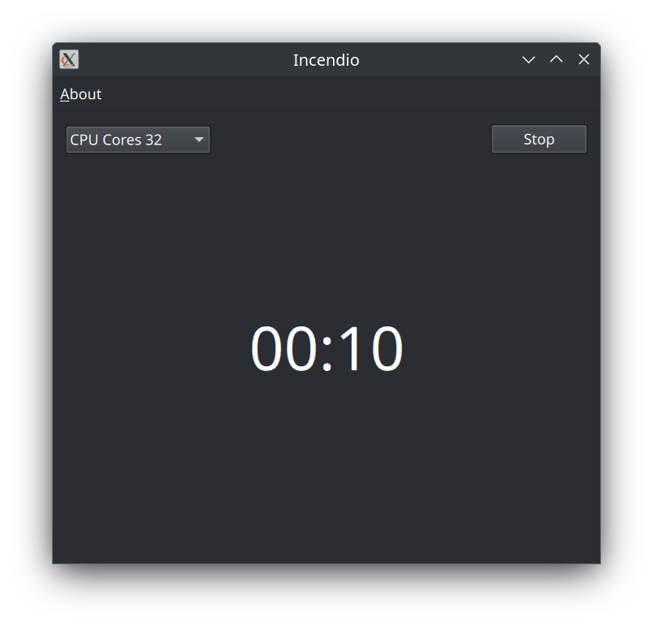
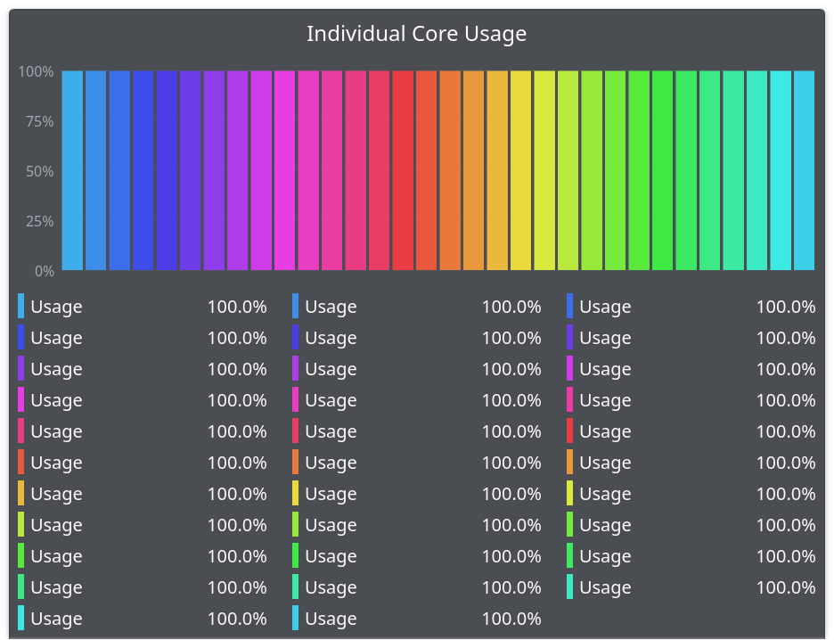

# Incendio

English | [中文](./README_ZH.md)

## Introduction

Incendio is a program designed to increase the temperature of your computer's CPU. It aims to facilitate the process of dismantling the CPU by raising its temperature, as this softens the thermal paste and makes it easier to disassemble.

## License

[GPL-3.0](LICENSE)
